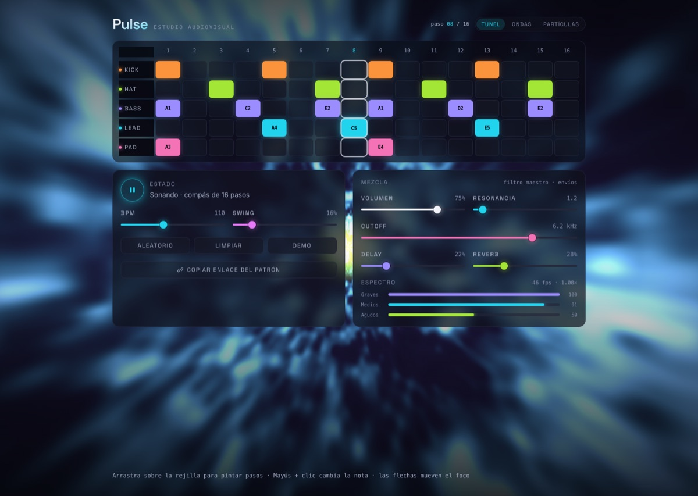
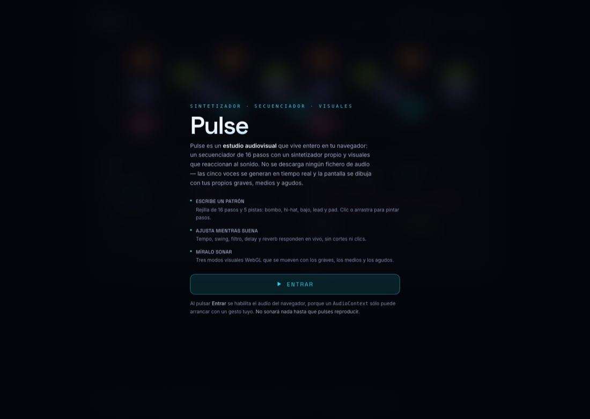
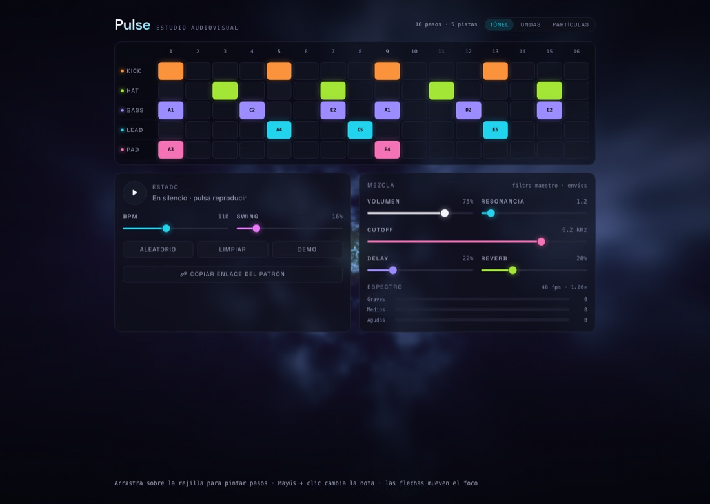
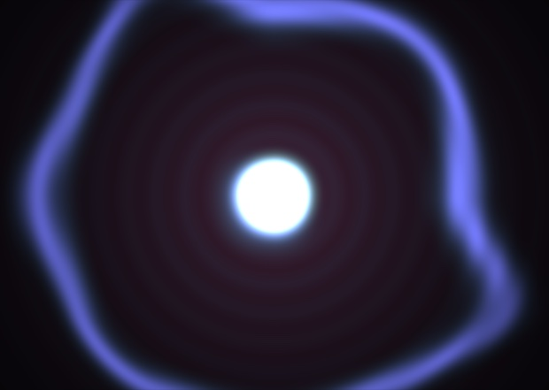
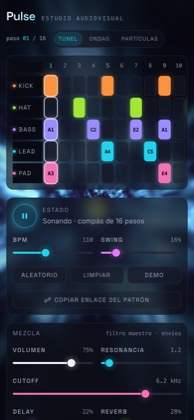

<div align="center">

# Pulse

**Estudio audiovisual interactivo en el navegador**
**Interactive audiovisual studio in the browser**

Secuenciador de 16 pasos · Sintetizador Web Audio escrito a mano · Visuales WebGL reactivos

[](https://pulse-blond-chi.vercel.app)
[](LICENSE)

[](https://svelte.dev)
[](https://svelte.dev)
[](https://www.typescriptlang.org)
[](https://tailwindcss.com)
[](https://developer.mozilla.org/docs/Web/API/Web_Audio_API)
[](https://developer.mozilla.org/docs/Web/API/WebGL_API)

[](#verificación)
[](#rendimiento-medido)
[](#por-qué-no-hay-más-dependencias)
[](#audio-síntesis-y-cadena-maestra)
[](#accesibilidad)

**[Demo en vivo](https://pulse-blond-chi.vercel.app)** · **[Repositorio](https://github.com/moisesvalero/pulse)** · **[Español](#español)** · **[English](#english)**



</div>

---

## Índice

| | |
|---|---|
| 🇪🇸 **[Español](#español)** | [Qué es](#qué-es) · [Capturas](#capturas) · [Cómo ejecutarlo](#cómo-ejecutarlo) · [Cómo se usa](#cómo-se-usa) · [Decisiones técnicas](#decisiones-técnicas) · [Verificación](#verificación) · [Rendimiento](#rendimiento-medido) · [Accesibilidad](#accesibilidad) · [Limitaciones](#limitaciones-conocidas) |
| 🇬🇧 **[English](#english)** | [What it is](#what-it-is) · [Screenshots](#screenshots) · [Running it](#running-it) · [How to use it](#how-to-use-it) · [Technical decisions](#technical-decisions) · [Verification](#verification) · [Performance](#measured-performance) · [Accessibility](#accessibility) · [Limitations](#known-limitations) |

---

## Español

### Qué es

**Pulse es un instrumento que cabe en una pestaña.** Escribes un patrón de 16 pasos en cinco pistas, lo ajustas mientras suena y ves cómo el audio dibuja la pantalla. No hay servidor, no hay claves de API y **no se descarga ningún fichero de audio**: las cinco voces se sintetizan en tiempo real y los visuales se renderizan con shaders GLSL propios.

- 🎛️ **5 voces sintetizadas** — tres voces sustractivas (bajo, lead, pad) con osciladores, filtro propio con envolvente y ADSR, más un bombo y un hi-hat generados por síntesis. Cero samples.
- ⏱️ **Scheduler con look-ahead** — el tempo lo marca el reloj del `AudioContext`, no un `setInterval`. La rejilla no se desvía aunque la pestaña se ponga a trabajar.
- 🌌 **3 modos visuales WebGL** — túnel de ruido, ondas radiales y campo de partículas, con shaders escritos a mano que reciben graves, medios y agudos por separado.
- 🔇 **Silencioso hasta que tú quieras** — al entrar no suena nada. El audio sólo arranca cuando pulsas reproducir.
- 🔗 **Compartible** — el patrón entero viaja en el hash de la URL y se guarda en `localStorage`.

### Capturas

**Pantalla de inicio** — qué es Pulse y qué vas a encontrar, antes de activar nada:



**El estudio, recién entrado y en silencio** — el estado por defecto: nada suena hasta que pulses reproducir:



**Los tres modos visuales**, cada uno reaccionando al análisis de espectro en vivo:

| Túnel de ruido | Ondas radiales | Campo de partículas |
|---|---|---|
|  |  |  |
| Graves abren la boca del túnel y aceleran el avance | Los medios deforman las ondas con ruido | Los agudos hacen centellear los puntos |

**En móvil**, con objetivos táctiles de 24 px y la rejilla desplazable con las etiquetas de pista fijas:



> Las capturas se generan con `pnpm docs:shots` contra un build real (`tools/readme-shots.mjs`), no son imágenes hechas a mano.

### Cómo ejecutarlo

Requiere **Node 20+** y **pnpm**.

```bash
pnpm install
pnpm dev          # servidor de desarrollo en http://localhost:5173
```

```bash
pnpm build        # genera el sitio estático en build/
pnpm preview      # sirve el build (vite preview)
pnpm check        # svelte-check: tipos y avisos de accesibilidad
pnpm test         # vitest: 140 tests de lógica pura
pnpm verify:visual # conduce el build en un navegador real (requiere Playwright)
pnpm docs:shots   # regenera las capturas de este README
```

Para desplegar, sube el contenido de `build/` a cualquier hosting estático (Netlify, Cloudflare Pages, GitHub Pages, un bucket S3…). No hace falta runtime de servidor. El build incluye `.br` y `.gz` para cada asset y un `.nojekyll` para GitHub Pages.

<details>
<summary><strong>Despliegue en Vercel</strong></summary>

El repo ya trae `vercel.json`, así que Vercel sólo tiene que construir y servir la carpeta estática:

```json
{
	"framework": null,
	"buildCommand": "pnpm run build",
	"outputDirectory": "build"
}
```

`framework: null` desactiva el preset de SvelteKit a propósito: ese preset espera `@sveltejs/adapter-vercel`, y aquí el adaptador es `adapter-static` (lo exige el brief), así que el proyecto se trata como sitio estático. No hace falta cambiar el adaptador ni el código.

El proyecto está enlazado con el repositorio de GitHub, así que **cada push a `main` despliega solo**. Para forzar un despliegue a mano:

```bash
pnpm dlx vercel link -p pulse --team <tu-equipo>
pnpm dlx vercel deploy --prod
```

`.vercelignore` deja fuera de la subida lo que no debe llegar al hosting: `node_modules`, `build`, `.svelte-kit`, los artefactos locales de verificación (`.verify`) y los ficheros de desarrollo (`tools`, `PROGRESS.md`).

</details>

### Cómo se usa

| Acción | Gesto |
|---|---|
| **Empezar a sonar** | Botón de reproducir (al entrar, Pulse está en silencio) |
| Activar o desactivar un paso | Clic o toque en la celda |
| Pintar varios pasos seguidos | Arrastrar sobre la rejilla |
| Cambiar la nota de un paso (pistas melódicas) | **Mayús + clic** (cicla la escala pentatónica) |
| Mover el foco por la rejilla | Flechas del teclado |
| Activar un paso con el teclado | `Espacio` o `Enter` |
| Cambiar de modo visual | Botones de la cabecera, o teclas `1` `2` `3` |
| Compartir el patrón | Botón *Copiar enlace del patrón* |

### Decisiones técnicas

#### Scheduler: dos relojes

El problema clásico de un secuenciador en el navegador es que el hilo principal se bloquea (un repintado, el recolector de basura, un `await`) y un `setInterval` llega tarde. Pulse usa el patrón *A Tale of Two Clocks*:

1. Un `setInterval` de **25 ms** se despierta y mira el reloj de audio.
2. Agenda todas las notas que caen dentro de los próximos **120 ms**, cada una con su **tiempo absoluto** (`AudioContext.currentTime + offset`).
3. El hilo de audio reproduce esas notas con precisión de muestra.

El temporizador decide *qué* suena; el reloj de audio decide *cuándo*. Un tirón de 100 ms en el hilo principal no afecta a la rejilla, porque esas notas ya estaban agendadas.

El núcleo de esta lógica, `planSteps()`, es una **función pura**: no toca Web Audio ni el DOM y devuelve los pasos que caen dentro de la ventana más el cursor para la siguiente llamada. El reloj y el temporizador se inyectan, así que los tests lo ejecutan con un reloj falso y un temporizador manual ([`scheduler.test.ts`](src/lib/audio/scheduler.test.ts)).

Detalles que importan:

- **El swing desplaza sólo los pasos impares** (hasta un tercio de paso, el *shuffle* clásico del 66 %) y **no toca la rejilla**: el cursor avanza siempre recto, así que el tempo no deriva.
- **Tope de 64 pasos por tick.** Si una pestaña en segundo plano se congela, el reloj de audio salta hacia delante. Es mejor descartar el atraso que agendar de golpe miles de notas.
- El indicador de paso se lee del **reloj de audio**, no del temporizador, así que el foco visual nunca se adelanta al sonido.

#### Audio: síntesis y cadena maestra

**Voces persistentes y monofónicas.** Los osciladores, filtros y envolventes de cada pista se crean una sola vez y se quedan vivos. Una nota no crea nodos: sólo escribe automatización (`setValueAtTime`, `linearRampToValueAtTime`) sobre parámetros que ya existen. Esto da tres cosas: cero asignaciones por paso mientras suena el patrón, la posibilidad de hacer *glide* (los osciladores no se reinician) y la ausencia de clics por creación y destrucción de nodos.

**Envolventes sin clics.** El pad libera durante más de un segundo y puede volver a dispararse antes de terminar. Saltar a cero en ese momento haría un clic audible, así que la envolvente usa `cancelAndHoldAtTime` para anclarse al valor que el parámetro *va a tener* en el instante del disparo, con un respaldo sobre `param.value` para implementaciones que no lo soportan. La lógica ([`envelope.ts`](src/lib/audio/envelope.ts)) trabaja sobre un subconjunto estructural de `AudioParam`, así que los tests verifican el orden de las rampas y la monotonía de la línea de tiempo sin navegador.

**Percusión sin samples.** El bombo es un seno con un barrido exponencial de 155 Hz a 47 Hz más un clic de ruido pasado por un filtro paso-alto. El hi-hat es ruido blanco generado en runtime (un `AudioBuffer` llenado con `Math.random`) a través de un paso-alto y un paso-banda. El ruido va **en bucle** en lugar de recrearse en cada golpe.

**Cadena maestra.** Las voces entran a un filtro paso-bajo común; de ahí salen tres caminos en paralelo (seco, delay, reverb) que se suman, pasan por un compresor, el fader de volumen y, por último, el `AnalyserNode`:

```
voces ─┬─► filtro ─┬─► seco ──────────────────┐
       │           ├─► delay ─► eco ──────────┤
       │           └─► convolver ─► reverb ───┤
       │                                      ▼
       └────────────────────────► compresor ─► volumen ─► analyser ─► salida
```

Delay y reverb son **caminos paralelos**, no *inserts*: los controles de mezcla son simples ganancias y se pueden mover en vivo sin cortar nunca la señal seca. El delay es una corchea con puntillo con el *feedback* amortiguado, y la reverb es un `ConvolverNode` alimentado con una respuesta al impulso generada (ruido con decaimiento exponencial, estéreo independiente): no se envía ningún fichero IR.

**Todo cambio en vivo va suavizado** con `setTargetAtTime` (constante de tiempo de 20 ms). Mover un slider nunca produce un escalón de ganancia, que es exactamente lo que se oye como un clic.

**Los parámetros se leen en vivo.** El motor no guarda una copia del patrón: recibe funciones que leen el estado de la aplicación en cada paso. Es imposible que la interfaz y el audio se desincronicen porque sólo hay una fuente de verdad.

**Entrar no es sonar.** Crear un `AudioContext` exige un gesto del usuario, así que el botón *Entrar* es el que lo desbloquea — pero no arranca el transporte. Desbloquear y reproducir son dos operaciones separadas ([`AudioEngine.unlock()`](src/lib/audio/engine.ts) frente a `play()`), y por eso Pulse nunca te recibe con música.

#### Visuales: WebGL propio y GLSL a mano

Se usa **WebGL 1 directo, sin OGL ni Three.js**. Los visuales son un quad a pantalla completa y un fragment shader propio; esas librerías añadirían más de 100 KB para funcionalidad que aquí no se usa.

Los tres modos comparten un **contrato de uniforms fijo** (`u_resolution`, `u_time`, `u_bands`, `u_level`, `u_intensity`), lo que permite cambiar de modo sin tocar el cableado. Añadir un modo es añadir un shader y una entrada en [`modes.ts`](src/lib/visuals/modes.ts).

Cada banda controla un parámetro **distinto**, que es lo que hace que los visuales parezcan escuchar en vez de sólo subir y bajar de brillo:

| Banda | Túnel | Ondas | Partículas |
|---|---|---|---|
| Graves | abre la boca del túnel, acelera el avance, enciende el núcleo | velocidad y alcance de las ondas | velocidad del flujo hacia fuera |
| Medios | energía global de la imagen | deforma las ondas con ruido | profundidad y desvanecido |
| Agudos | mezcla una octava de ruido más fina y tiñe | superpone un rizo fino | hace centellear los puntos |

El análisis del espectro vive en [`analysis.ts`](src/lib/visuals/analysis.ts) y es **lógica pura**: `computeBands()` promedia el espectro por ventanas de frecuencia y `smoothBands()` aplica un suavizado asimétrico (ataque rápido, caída lenta), que es lo que hace que los visuales golpeen con el transitorio y luego decaigan.

**Rendimiento.** Un shader a pantalla completa permanente es lo más caro de la página. [`ResolutionController`](src/lib/visuals/performance.ts) mide los fps y, si se mantienen por debajo de 45, baja la resolución interna por una escalera discreta (1 → 0,85 → 0,7 → 0,6 → 0,5). Una vez que sube, tarda mucho más en recuperarla: la histéresis evita el vaivén entre dos resoluciones, que se ve peor que quedarse en la baja. Es lógica pura y está cubierta por tests. Además, el renderer **no arranca hasta que el usuario entra**: en la pantalla de inicio el shader queda tapado por un overlay casi opaco y rasterizarlo era, con diferencia, el mayor coste de carga.

#### Accesibilidad

- La rejilla es una `<table>` real con `th scope="row"` y `scope="col"`, y cada celda es un `<button aria-pressed>`: un lector de pantalla obtiene la relación fila/columna gratis, sin reimplementar el patrón ARIA `grid`.
- Todos los sliders llevan `<label for>` de verdad, más `aria-valuetext` con la unidad.
- Foco visible consistente en todo el sitio (`:focus-visible` con anillo de 2 px), medido sobre el fondo compuesto.
- **Contraste auditado**: cada elemento de texto se comprueba contra su fondo real (componiendo las capas con alfa). Dos tokens de color se ajustaron como consecuencia.
- `prefers-reduced-motion` colapsa las animaciones y transiciones CSS **y** baja la intensidad del shader a 0,3, en lugar de congelar la imagen: un frame totalmente estático se lee como "roto".
- Objetivos táctiles de 24 × 24 px como mínimo (WCAG 2.5.8), medidos sobre el layout real a 390 px de ancho.

#### Por qué no hay más dependencias

El paquete no tiene **ninguna dependencia de runtime**: `dependencies` está vacío. Las `devDependencies` son sólo herramientas de build y test (Svelte, SvelteKit, Tailwind, Vite, TypeScript, svelte-check, Vitest y sus plugins). Todo lo que suena y todo lo que se ve es código propio: la síntesis, los shaders, el scheduler, el códec de URL, el control de rendimiento y hasta el helper de clases CSS. Playwright se usa para verificar, pero **no** es dependencia del proyecto: la app no lo necesita.

### Verificación

```bash
pnpm check            # 0 errores, 0 avisos
pnpm test             # 140 tests en 9 ficheros
pnpm build            # sitio estático en build/
```

Además hay una pasada de navegador real que arranca el sitio construido, lo conduce y **mide el grafo de audio**:

```bash
python3 -m http.server 4173 --directory build   # en una terminal
pnpm verify:visual                              # en otra
```

Usa el Playwright que ya tengas instalado y escribe capturas y un `report.json` en `.verify/`. Comprueba, entre otras cosas: que no hay errores de consola, que **al entrar no suena nada** y el `AudioContext` se crea exactamente una vez con el gesto, que los tres modos visuales producen frames distintos, que el analizador lleva señal mientras suena, que el brillo del canvas sube con el audio y que el grafo cae a **cero exacto** cuando la cola de delay y reverb se apaga (lo que detectaría un oscilador atascado o una fuga de continua).

La misma batería se puede lanzar contra el sitio desplegado:

```bash
PULSE_URL=https://pulse-blond-chi.vercel.app pnpm verify:visual
```

### Rendimiento medido

Lighthouse 12.8.2, Chromium headless, sobre el build de producción. La primera columna es un servidor mínimo (`python3 -m http.server`, sin compresión ni cabeceras de caché) y la segunda `vite preview`, que ya usa keep-alive y caché:

| Métrica | Servidor mínimo | `vite preview` |
|---|---|---|
| Rendimiento | 92 | **99** |
| Accesibilidad | **100** | **100** |
| Buenas prácticas | **100** | **100** |
| SEO | **100** | **100** |
| First Contentful Paint | 2,5 s | 1,4 s |
| Largest Contentful Paint | 2,9 s | 2,0 s |
| Total Blocking Time | **0 ms** | **0 ms** |
| Cumulative Layout Shift | **0** | **0** |

La primera medición dio 65 en rendimiento y 930 ms de bloqueo, con 2,1 s de evaluación de script: el shader a pantalla completa se estaba rasterizando en software por un canvas que la pantalla de inicio tapa casi por completo. No arrancar el renderer hasta que el usuario entra bajó la evaluación de script a **68 ms** y el bloqueo a **0 ms**. El build emite además `.br` y `.gz` (`precompress: true`), así que cualquier hosting estático puede servir respuestas comprimidas sin configurar nada.

**Peso servido** (gzip): 50,5 KB de JavaScript, 6,6 KB de CSS y 70,8 KB de fuentes auto-hospedadas.

### Limitaciones conocidas

- **El sonido no está verificado de oído.** Que el grafo produzca señal, responda a los parámetros y caiga a silencio exacto está medido; que suene *bien* es un juicio humano que no se puede automatizar.
- **Sólo verificado en Chromium.** El código usa Web Audio estándar y GLSL ES 1.00 (portátil a todos los navegadores), pero no se ha probado en Safari ni en Firefox.
- **Arrastrar para pintar en táctil** funciona, pero un arrastre claramente vertical se interpreta como scroll y el navegador cancela el gesto de pintado. El toque simple siempre funciona.
- **Despliegue en subdirectorio:** el sitio asume que se sirve desde `/`; publicarlo en un subpath exige `paths.base` y cambiar las rutas de `/fonts/`.
- **Las voces son monofónicas.** Es una decisión de diseño (permite *glide* y no asigna nodos por nota), no una limitación técnica; un pad polifónico necesitaría un *voice allocator*.
- No hay *swing* por pista, ni lanes de acento, ni longitud de nota por paso.
- **Una alerta de Dependabot abierta, de severidad baja y sin exposición real.** `cookie@0.6.0` entra por `@sveltejs/kit` ([GHSA-pxg6-pf52-xh8x](https://github.com/advisories/GHSA-pxg6-pf52-xh8x), corregida en `0.7.0`). Es una dependencia de **desarrollo**: el build estático no incluye código de servidor, así que no llega al navegador ni procesa cookies en producción porque no hay servidor. La última versión **estable** de SvelteKit sigue fijando `^0.6.0`; el arreglo sólo está en los pre-releases de SvelteKit 3. Se ha preferido **no** forzar un `pnpm.overrides` fuera del rango declarado por el framework para no introducir un riesgo mayor que el que resuelve.

### Estructura

```
src/lib/audio/       síntesis, envolventes, percusión, cadena maestra, motor, scheduler, patrones
src/lib/visuals/     helpers de WebGL, shaders GLSL, catálogo de modos, espectro, rendimiento
src/lib/stores/      estado de la app (runas de Svelte 5) y persistencia
src/lib/components/  interfaz
src/lib/utils/       códec de URL, mapeo de sliders, helper de clases
tools/               verificación y capturas en navegador real
docs/                capturas usadas en este README
```

### Licencia

[MIT](LICENSE) © 2026 Moisés Valero. Haz lo que quieras con el código.

Las tipografías [Space Grotesk](https://github.com/floriankarsten/space-grotesk) e [Inter](https://github.com/rsms/inter) se distribuyen bajo SIL Open Font License 1.1, **no** bajo la MIT: sus textos completos están en [`static/fonts/`](static/fonts/).

### Créditos

El ruido de valor 3D de los shaders está adaptado de la conocida función de [Inigo Quilez](https://iquilezles.org/articles/gradientnoise/).

---

## English

### What it is

**Pulse is an instrument that fits in a browser tab.** You draw a 16-step pattern across five lanes, tweak it while it plays, and watch the audio paint the screen. There is no server, no API key and **no audio file is ever downloaded**: all five voices are synthesised in real time and the visuals are rendered with hand-written GLSL shaders.

- 🎛️ **5 synthesised voices** — three subtractive voices (bass, lead, pad) with oscillators, a per-voice filter with its own envelope, and an ADSR, plus a kick and a hi-hat built from synthesis. No samples.
- ⏱️ **Look-ahead scheduler** — tempo comes from the `AudioContext` clock, not from `setInterval`. The grid does not drift even when the tab gets busy.
- 🌌 **3 WebGL visual modes** — noise tunnel, radial waves and particle field, with hand-written shaders fed separate bass, mid and treble bands.
- 🔇 **Silent until you say otherwise** — entering the studio makes no sound. Audio only starts when you press play.
- 🔗 **Shareable** — the whole patch travels in the URL hash and is saved to `localStorage`.

### Screenshots

**Start screen** — what Pulse is and what you are about to open, before anything is enabled:


**The studio, just entered and silent** — the default state: nothing plays until you press play:


**The three visual modes**, each reacting to the live spectrum analysis:

| Noise tunnel | Radial waves | Particle field |
|---|---|---|
|  |  |  |
| Bass opens the tunnel mouth and drives travel speed | Mid band warps the wavefronts with noise | Treble makes the points twinkle |

**On mobile**, with 24 px touch targets and the grid scrolling under pinned lane labels:


> The screenshots are generated by `pnpm docs:shots` against a real build ([`tools/readme-shots.mjs`](tools/readme-shots.mjs)); they are not hand-made images.

### Running it

Needs **Node 20+** and **pnpm**.

```bash
pnpm install
pnpm dev          # dev server on http://localhost:5173
```

```bash
pnpm build         # static site into build/
pnpm preview       # serve the build (vite preview)
pnpm check         # svelte-check: types and a11y warnings
pnpm test          # vitest: 140 pure-logic tests
pnpm verify:visual # drives the build in a real browser (needs Playwright)
pnpm docs:shots    # regenerates the screenshots in this README
```

To deploy, upload the contents of `build/` to any static host (Netlify, Cloudflare Pages, GitHub Pages, an S3 bucket…). No server runtime required. The build ships `.br` and `.gz` for every asset plus a `.nojekyll` for GitHub Pages.

<details>
<summary><strong>Deploying to Vercel</strong></summary>

The repo already ships a `vercel.json`, so Vercel only has to build and serve the static folder:

```json
{
	"framework": null,
	"buildCommand": "pnpm run build",
	"outputDirectory": "build"
}
```

`framework: null` deliberately disables the SvelteKit preset: that preset expects `@sveltejs/adapter-vercel`, and this project uses `adapter-static` (the brief requires it), so it is treated as a plain static site. Neither the adapter nor any code has to change.

The project is linked to the GitHub repository, so **every push to `main` deploys on its own**. To force a deployment by hand:

```bash
pnpm dlx vercel link -p pulse --team <your-team>
pnpm dlx vercel deploy --prod
```

`.vercelignore` keeps out of the upload whatever should not reach the host: `node_modules`, `build`, `.svelte-kit`, the local verification artifacts (`.verify`) and the development-only files (`tools`, `PROGRESS.md`).

</details>

### How to use it

| Action | Gesture |
|---|---|
| **Start the sound** | Play button (entering Pulse is silent) |
| Toggle a step | Click or tap the cell |
| Paint several steps | Drag across the grid |
| Change a step's note (melodic lanes) | **Shift + click** (cycles the pentatonic scale) |
| Move focus around the grid | Arrow keys |
| Toggle a step with the keyboard | `Space` or `Enter` |
| Switch visual mode | Header buttons, or `1` `2` `3` |
| Share the patch | *Copy pattern link* button |

### Technical decisions

#### Scheduler: two clocks

The classic problem with a browser sequencer is that the main thread stalls (a repaint, the garbage collector, an `await`) and a `setInterval` fires late. Pulse uses the *A Tale of Two Clocks* pattern:

1. A **25 ms** `setInterval` wakes up and reads the audio clock.
2. It schedules every note falling inside the next **120 ms**, each stamped with an **absolute** time (`AudioContext.currentTime + offset`).
3. The audio thread plays those notes with sample accuracy.

The timer decides *what* plays; the audio clock decides *when*. A 100 ms main-thread hiccup cannot affect the grid, because those notes were already scheduled.

The core of that logic, `planSteps()`, is a **pure function**: it touches neither Web Audio nor the DOM, and returns the steps inside the window plus the cursor for the next call. The clock and the timer are injected, so tests drive it with a fake clock and a manual timer ([`scheduler.test.ts`](src/lib/audio/scheduler.test.ts)).

Details that matter:

- **Swing only displaces odd steps** (up to a third of a step, the classic 66 % shuffle) and **never touches the grid**: the cursor always advances straight, so the tempo cannot drift.
- **Hard cap of 64 steps per tick.** If a background tab freezes, the audio clock jumps forward. Dropping the backlog beats scheduling thousands of notes at once.
- The step indicator reads the **audio clock**, not the timer, so the visual focus never runs ahead of the sound.

#### Audio: synthesis and the master chain

**Persistent, monophonic voices.** Each lane's oscillators, filters and envelopes are created once and stay alive. A note allocates nothing: it only writes automation (`setValueAtTime`, `linearRampToValueAtTime`) onto parameters that already exist. That buys three things: zero allocations per step while a pattern runs, real *glide* (the oscillators never restart), and no clicks from creating and destroying nodes.

**Click-free envelopes.** The pad releases for over a second and can be retriggered before it finishes. Jumping to zero there would be an audible click, so the envelope uses `cancelAndHoldAtTime` to anchor on the value the parameter *will* have at the trigger instant, with a fallback onto `param.value` for implementations that lack it. The envelope logic ([`envelope.ts`](src/lib/audio/envelope.ts)) targets a structural subset of `AudioParam`, so tests verify ramp ordering and timeline monotonicity without a browser.

**Sample-free percussion.** The kick is a sine swept exponentially from 155 Hz to 47 Hz plus a high-passed noise click. The hi-hat is white noise generated at runtime (an `AudioBuffer` filled with `Math.random`) through a high-pass and a band-pass. The noise **loops** instead of being recreated per hit.

**Master chain.** Voices feed a shared low-pass filter; from there three parallel paths (dry, delay, reverb) sum into a compressor, the volume fader and finally the `AnalyserNode`:

```
voices ─┬─► filter ─┬─► dry ───────────────────┐
        │           ├─► delay ─► echoes ───────┤
        │           └─► convolver ─► reverb ───┤
        │                                      ▼
        └────────────────────────► compressor ─► volume ─► analyser ─► out
```

Delay and reverb are **parallel paths**, not inserts: the mix controls are plain gains that can be moved live without ever cutting the dry signal. The delay is a dotted eighth with damped feedback, and the reverb is a `ConvolverNode` fed a generated impulse response (exponentially decaying noise, independent stereo channels): no IR file is shipped.

**Every live change is smoothed** with `setTargetAtTime` (20 ms time constant). Moving a slider never produces a gain step, which is exactly what you hear as a click.

**Parameters are read live.** The engine keeps no copy of the pattern: it is handed functions that read application state on every step. The UI and the audio cannot drift apart because there is a single source of truth.

**Entering is not playing.** Creating an `AudioContext` requires a user gesture, so the *Enter* button is what unlocks it — but it does not start the transport. Unlocking and playing are two separate operations ([`AudioEngine.unlock()`](src/lib/audio/engine.ts) versus `play()`), which is why Pulse never greets you with music.

#### Visuals: raw WebGL and hand-written GLSL

This uses **raw WebGL 1, with no OGL or Three.js**. The visuals are one full-screen quad and one fragment shader; those libraries would add over 100 KB for functionality that goes unused here.

All three modes share a **fixed uniform contract** (`u_resolution`, `u_time`, `u_bands`, `u_level`, `u_intensity`), which is what lets the renderer switch modes without touching the plumbing. Adding a mode means adding a shader and an entry in [`modes.ts`](src/lib/visuals/modes.ts).

Each band drives a **different** parameter, which is what makes the visuals look like they are listening rather than just getting brighter:

| Band | Tunnel | Waves | Particles |
|---|---|---|---|
| Bass | opens the tunnel mouth, drives travel speed, lights the throat | wave speed and reach | outward flow speed |
| Mid | overall image energy | warps the wavefronts with noise | depth fade |
| Treble | mixes in a finer noise octave, tints | overlays a fine ripple | makes the points twinkle |

Spectrum analysis lives in [`analysis.ts`](src/lib/visuals/analysis.ts) and is **pure logic**: `computeBands()` averages the spectrum over frequency windows and `smoothBands()` applies asymmetric smoothing (fast attack, slow release), which is what makes the visuals hit on the transient and then decay.

**Performance.** A permanently running full-screen shader is the most expensive thing on the page. [`ResolutionController`](src/lib/visuals/performance.ts) measures the frame rate and, when it stays under 45 fps, steps the internal resolution down a discrete ladder (1 → 0.85 → 0.7 → 0.6 → 0.5). Climbing back takes far longer: hysteresis avoids flapping between two resolutions, which looks worse than staying at the low one. It is pure logic, covered by tests. On top of that the renderer **does not start until the user walks in**: on the start screen the shader sits behind a nearly opaque overlay, and rasterising it was by far the largest load-time cost.

#### Accessibility

- The grid is a real `<table>` with `th scope="row"` and `scope="col"`, and every cell is an `aria-pressed` `<button>`: a screen reader gets the row/column relationship for free, without reimplementing the ARIA `grid` pattern.
- Every slider has a real `<label for>`, plus `aria-valuetext` carrying the unit.
- A consistent visible focus ring everywhere (`:focus-visible`, 2 px outline), measured against the composited background.
- **Contrast is audited**: every text element is checked against its real background (blending ancestor layers with alpha). Two colour tokens were adjusted as a result.
- `prefers-reduced-motion` collapses CSS animations and transitions **and** drops shader intensity to 0.3, rather than freezing the picture: a completely static frame reads as "broken".
- Touch targets are at least 24 × 24 px (WCAG 2.5.8), measured on the real layout at 390 px wide.

#### Why there are so few dependencies

The package has **no runtime dependencies at all**: `dependencies` is empty. The `devDependencies` are build and test tooling only (Svelte, SvelteKit, Tailwind, Vite, TypeScript, svelte-check, Vitest and their plugins). Everything you hear and everything you see is written here: synthesis, shaders, scheduler, URL codec, performance controller, and even the CSS class helper. Playwright is used for verification but is **not** a project dependency: the app does not need it.

### Verification

```bash
pnpm check            # 0 errors, 0 warnings
pnpm test             # 140 tests across 9 files
pnpm build            # static site into build/
```

On top of that there is a real-browser pass that boots the built site, drives it and **measures the audio graph**:

```bash
python3 -m http.server 4173 --directory build   # one shell
pnpm verify:visual                              # another
```

It uses whatever Playwright you already have and writes screenshots and a `report.json` to `.verify/`. Among other things it checks: no console errors, that **entering makes no sound** and the `AudioContext` is created exactly once by the gesture, that the three visual modes render different frames, that the analyser carries signal while playing, that canvas brightness rises with audio, and that the graph falls to **exactly zero** once the delay and reverb tails decay (which would catch a stuck oscillator or a DC leak).

The same battery can be pointed at the deployed site:

```bash
PULSE_URL=https://pulse-blond-chi.vercel.app pnpm verify:visual
```

### Measured performance

Lighthouse 12.8.2, headless Chromium, against the production build. The first column is a minimal server (`python3 -m http.server`, no compression, no cache headers) and the second is `vite preview`, which already does keep-alive and caching:

| Metric | Minimal server | `vite preview` |
|---|---|---|
| Performance | 92 | **99** |
| Accessibility | **100** | **100** |
| Best practices | **100** | **100** |
| SEO | **100** | **100** |
| First Contentful Paint | 2.5 s | 1.4 s |
| Largest Contentful Paint | 2.9 s | 2.0 s |
| Total Blocking Time | **0 ms** | **0 ms** |
| Cumulative Layout Shift | **0** | **0** |

The first run scored 65 for performance with 930 ms of blocking time and 2.1 s of script evaluation: the full-screen shader was being software-rasterised behind a start screen that almost completely covers it. Not starting the renderer until the user walks in took script evaluation down to **68 ms** and blocking time to **0 ms**. The build also emits `.br` and `.gz` (`precompress: true`), so any static host can serve compressed responses with no configuration.

**Served weight** (gzip): 50.5 KB of JavaScript, 6.6 KB of CSS and 70.8 KB of self-hosted fonts.

### Known limitations

- **Sound is not verified by ear.** That the graph produces signal, responds to parameters and falls to exact silence is measured; whether it *sounds good* is a human judgement that cannot be automated.
- **Only verified in Chromium.** The code uses standard Web Audio and GLSL ES 1.00 (portable to every browser), but it has not been tested in Safari or Firefox.
- **Drag-to-paint on touch** works, but a clearly vertical drag is read as a scroll and the browser cancels the paint gesture. A plain tap always works.
- **Subdirectory deployment:** the site assumes it is served from `/`; publishing under a subpath requires `paths.base` and changing the `/fonts/` paths.
- **Voices are monophonic.** That is a design choice (it enables *glide* and allocates nothing per note), not a technical limit; a polyphonic pad would need a voice allocator.
- No per-lane swing, no accent lanes, no per-step note length.
- **One open Dependabot alert, low severity, with no real exposure.** `cookie@0.6.0` comes in through `@sveltejs/kit` ([GHSA-pxg6-pf52-xh8x](https://github.com/advisories/GHSA-pxg6-pf52-xh8x), patched in `0.7.0`). It is a **development** dependency: the static build contains no server code, so it never reaches the browser and never processes cookies in production, because there is no server. The latest **stable** SvelteKit still pins `^0.6.0`; the fix only exists in the SvelteKit 3 pre-releases. Forcing a `pnpm.overrides` outside the range the framework declares was deliberately avoided, since it would introduce more risk than it removes.

### Layout

```
src/lib/audio/       synthesis, envelopes, percussion, master chain, engine, scheduler, patterns
src/lib/visuals/     WebGL helpers, GLSL shaders, mode catalogue, spectrum, performance
src/lib/stores/      app state (Svelte 5 runes) and persistence
src/lib/components/  interface
src/lib/utils/       URL codec, slider mapping, class helper
tools/               real-browser verification and screenshot generation
docs/                screenshots used by this README
```

### License

[MIT](LICENSE) © 2026 Moisés Valero. Do whatever you like with the code.

The [Space Grotesk](https://github.com/floriankarsten/space-grotesk) and [Inter](https://github.com/rsms/inter) typefaces are distributed under the SIL Open Font License 1.1, **not** MIT: their full texts live in [`static/fonts/`](static/fonts/).

### Credits

The shaders' 3D value noise is adapted from [Inigo Quilez](https://iquilezles.org/articles/gradientnoise/)'s well-known function.

---

<div align="center">

### Temas / Topics

[](https://github.com/topics/sveltekit)
[](https://github.com/topics/svelte)
[](https://github.com/topics/typescript)
[](https://github.com/topics/tailwindcss)
[](https://github.com/topics/web-audio)
[](https://github.com/topics/webgl)
[](https://github.com/topics/glsl)
[](https://github.com/topics/sequencer)
[](https://github.com/topics/synthesizer)
[](https://github.com/topics/creative-coding)
[](https://github.com/topics/audio-visualizer)
[](https://github.com/topics/portfolio)

<sub>Hecho con Web Audio y WebGL, sin frameworks de audio ni de 3D · Built with Web Audio and WebGL, no audio or 3D frameworks</sub>

</div>
